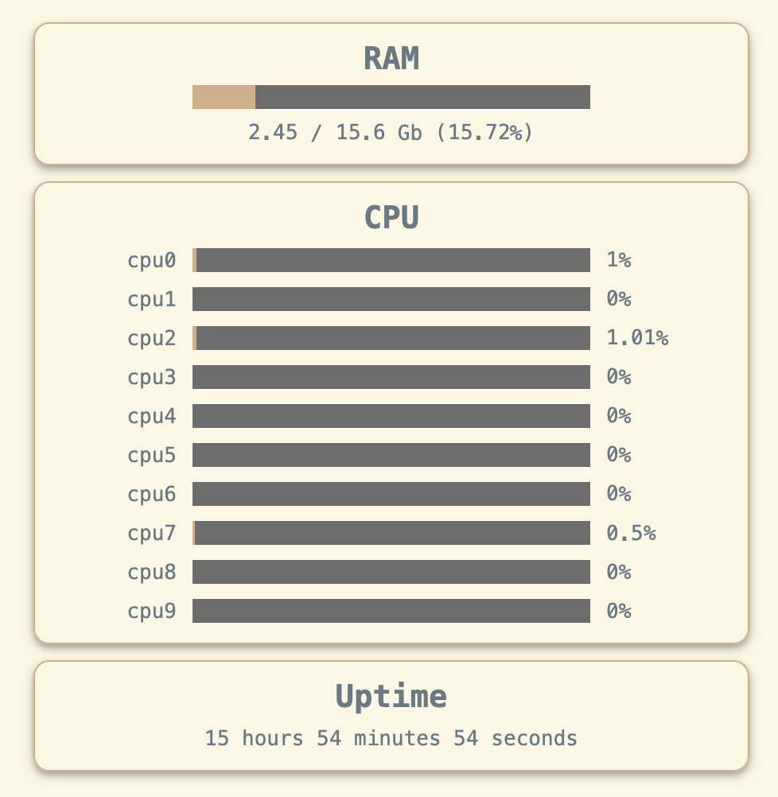

# Themes

## Default

This is the theme that applies by default


```css
body {
  --component-loadline-empty-color: lightgray;
  --component-loadline-filled-color: seagreen;
  --component-loadline-height: 15px;
  --component-loadline-width: 250px;

  --component-card-backgroud-color: white;
  --component-card-backgroud-border: 1px solid lightgray;
  --component-card-header-color: black;

  --body-background-color: white;
  --body-text-color: black;
}
```

## Ayu

Theme inspired by [ayu theme](https://github.com/ayu-theme) for text editors


```css
body {
  --bg: #1f2430;
  --text: #cccac2;

  --component-loadline-empty-color: #409fff40;
  --component-loadline-filled-color: #ffcc66;
  --component-loadline-height: 15px;
  --component-loadline-width: 250px;

  --component-card-backgroud-color: var(--bg);
  --component-card-backgroud-border: 1px solid #409fff40;
  --component-card-header-color: var(--text);

  --body-background-color: var(--bg);
  --body-text-color: var(--text);
}
```

## Solarized Light

Theme based on VSCode Solarized Light theme



```css
body {
  --bg: #FDF6E3;
  --text: #657B83;

  --component-loadline-empty-color: #6C6C6C;
  --component-loadline-filled-color: #D3AF86;
  --component-loadline-height: 15px;
  --component-loadline-width: 250px;

  --component-card-backgroud-color: var(--bg);
  --component-card-backgroud-border: 1px solid #D3AF86;
  --component-card-header-color: var(--text);

  --body-background-color: var(--bg);
  --body-text-color: var(--text);
}
```
